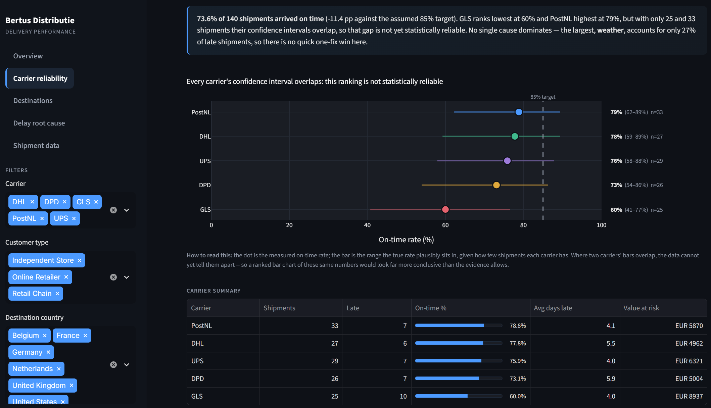
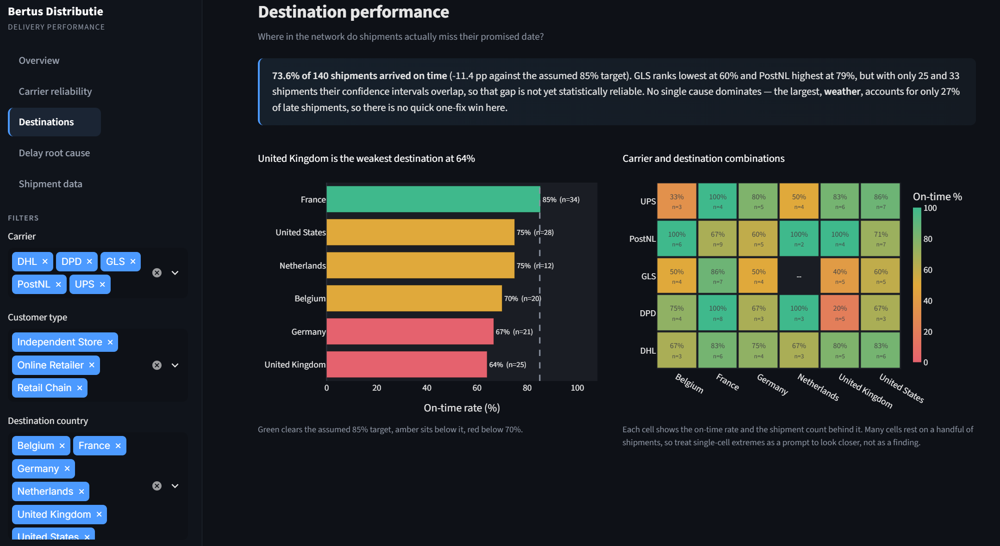
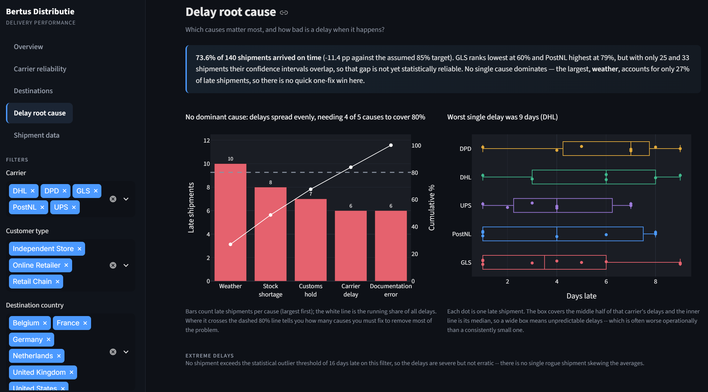
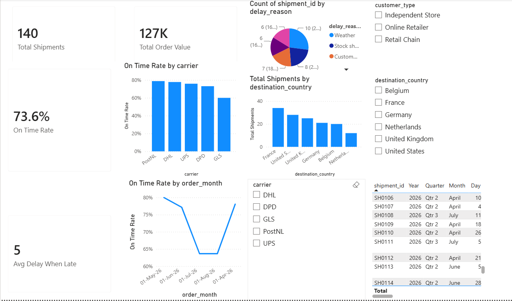

# Bertus Delivery Performance Dashboard


An end to end delivery performance analytics project, built twice: once in Python (pandas, Plotly, Streamlit) and once in Power BI (Power Query, DAX), on the same dataset. Built to practice the exact SLA and delay reporting an operations or supply chain analyst role would own.

## The business problem

Bertus Distributie is a physical media wholesale distributor (vinyl, CD, DVD, merchandise) shipping to independent stores, retail chains, and online retailers across the Netherlands and neighboring countries. A distributor like this runs on carrier SLAs it doesn't fully control, so the recurring operational question is: **which carriers and routes are actually costing us on time performance, why, and what should change about how we route shipments?** That's the question a logistics or supply chain analyst is hired to answer with data instead of guesswork, and the one this project is built to practice end to end, from dirty raw data to a recommendation someone could act on.

This project simulates that scenario with 140 shipment records, deliberately shipped "dirty": plain text dates, no precomputed on time flags or delay figures, so real cleaning work has to happen before any analysis can start, and the output has to stand on its own as something you'd actually hand to an operations manager.

## The data

The raw dataset (`data/bertus_shipments_raw.csv`) is 140 synthetic shipment records built to mirror Bertus's real business: physical media (vinyl, CD, DVD, and merchandise) shipped to three customer types (independent stores, retail chains, online retailers) across six destination countries (Netherlands, Germany, Belgium, France, United Kingdom, United States) through five carriers (PostNL, DHL, DPD, GLS, UPS). Each row carries an order date, a promised delivery date, an actual delivery date, an order value in EUR, and, only when the shipment ran late, a delay reason (Carrier delay, Customs hold, Stock shortage, Documentation error, or Weather).

It ships dirty in two ways that mirror how operational data usually looks before an analyst gets to it. First, the three date fields are plain text, not real date objects, so nothing can be compared or aggregated until they're parsed. Second, none of the fields an analyst actually needs exist yet: whether a shipment was late, by how many days, and which calendar month it belongs to all have to be derived rather than read off the sheet. The delay_reason field is blank for the 103 shipments that arrived on time, which also has to be handled explicitly rather than silently dropped or mistaken for missing data.

## Key findings and recommendations

Overall on time rate is 73.6%. Of the 140 shipments, 37 ran late, accounting for EUR 31,094 of the EUR 126,797 in total order value, close to a quarter of everything shipped. That's frequent enough, and touches enough order value, to justify a standing SLA review rather than an isolated fix.

GLS is disproportionately responsible for the lateness. It carries 17.9% of total shipment volume (25 of 140 shipments) but accounts for 27% of all late shipments (10 of 37), with EUR 8,937 of delayed order value sitting on GLS shipments alone. PostNL, by contrast, is the most reliable carrier at a 78.8% on time rate. **Recommendation:** reroute GLS's weather exposed and cross border lanes to PostNL or DHL first, rather than spreading a fix evenly across all five carriers. The data points to one carrier as the biggest leverage place to start, not a general policy change.

Weather is the single largest cause of delay, responsible for 27% of all late shipments and EUR 5,984 of exposed order value, ahead of stock shortages (21.6%) and customs holds (18.9%). **Recommendation:** build a weather based buffer into promised delivery windows on the routes most exposed to it, instead of committing to one flat SLA regardless of season or carrier. The alternative is repeatedly promising dates the business can't reliably hit on some lanes.

On time performance dropped sharply from June to July 2026. **Recommendation:** before treating that drop as a new baseline, check whether it tracks a change in carrier mix, order volume, or seasonal weather exposure over the same window. A trend like this is a starting point for investigation, not a finding to act on by itself.

One caveat: with only 140 shipments in this sample, carrier level differences carry real uncertainty. The confidence interval view on the Carrier reliability page shows some carriers' ranges overlap, so it's worth confirming GLS's gap holds up as more shipment data comes in before committing budget to rerouting.

Next steps, in order of effort: reroute GLS's most exposed lanes first, since it needs no new tooling. Pilot a weather based delivery buffer for one quarter on the routes most affected. Then set a monthly on time rate review, so a drop like the one from June to July gets caught and investigated within weeks instead of a quarter later.

## Dashboard

Three fields are derived before any of this: delay_days (actual delivery date minus promised delivery date), is_late (true when delay_days is greater than zero), and order_month (the order date rounded to its calendar month). Every chart below builds on those three fields, computed with pandas in the Streamlit version and with Power Query plus DAX in the Power BI version.

**Overview**

On time rate is one minus the average of is_late, shown against an assumed SLA target so the gap reads in percentage points. The line chart tracks on time rate by month, and the bar chart ranks it by carrier.


**Carrier reliability**

Adds a 95% confidence interval to each carrier's on time rate, using the Wilson method. This is the range the true rate likely falls in, so where two carriers' ranges overlap, the data cannot yet tell them apart. The table also shows value at risk: the total order value tied to each carrier's late shipments.



**Destinations**

A heat map of on time rate for every carrier and country pair, so a weak route shows up directly instead of being hidden inside a carrier or country average.



**Delay root cause**

Ranks delay reasons by count, then adds a running total line showing what share of all delays each reason covers, so you can see how many causes you would need to fix to clear most of the problem. The box plot shows the full spread of delay days per carrier, not just the average, and unusually long delays are flagged as outliers using a standard statistical rule.



**Power BI version**

The same core numbers (on time rate, average delay, and the breakdowns by carrier, month, and country) rebuilt in Power Query and DAX. The confidence intervals, value at risk, heat map, and outlier flags above are Streamlit only for now, since porting them means writing the same logic by hand in DAX.



## How to run it

**Streamlit version:**
```
pip install -r requirements.txt
streamlit run app.py
```
Then open the local URL it gives you (usually `http://localhost:8501`).

**Power BI version:**
Open `bertus_delivery_dashboard.pbix` directly in Power BI Desktop (free from Microsoft).

## Data note

All data is synthetic, generated by `scripts/generate_raw_data.py`. It is modeled on Bertus Distributie's real business context (product types, carriers, destination countries) but contains no real company data.

## About

Built by Adrian Vanderlinder.

[LinkedIn](https://www.linkedin.com/in/adrian-vanderlinder-azcona-59b1299b) · [GitHub](https://github.com/adrianjva18) · adrian.azcona18@gmail.com
