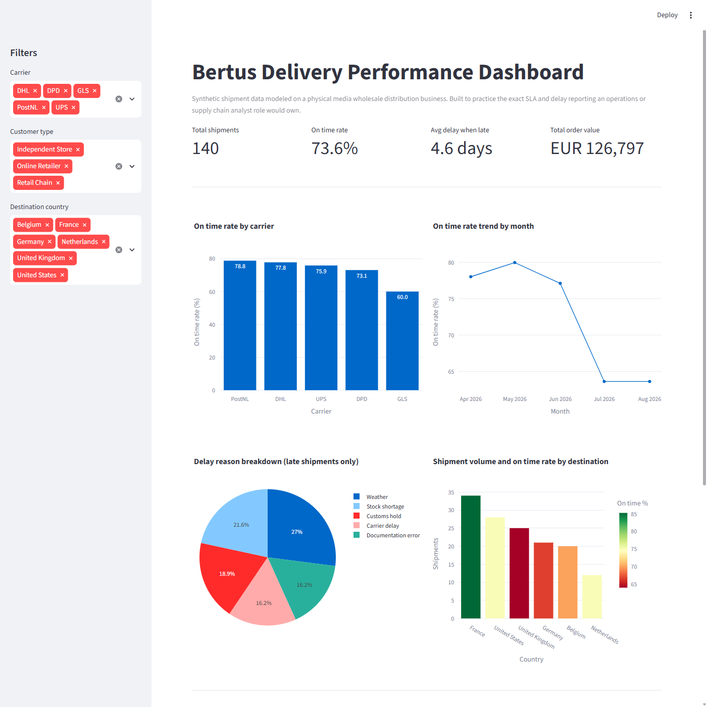

# Bertus Delivery Performance Dashboard


An end to end delivery performance analytics project, built twice: once in Python (pandas, Plotly, Streamlit) and once in Power BI (Power Query, DAX), on the same dataset. Built to practice the exact SLA and delay reporting an operations or supply chain analyst role would own.

## The business problem

Bertus Distributie is a physical media wholesale distributor (vinyl, CD, DVD, merchandise) shipping to independent stores, retail chains, and online retailers across the Netherlands and neighboring countries. Knowing which carriers underperform, which destinations see the most delays, and why, is exactly the kind of recurring operational question a logistics or supply chain analyst answers with data, not guesswork.

This project simulates that scenario with 140 shipment records, deliberately shipped "dirty": plain text dates, no precomputed on time flags or delay figures, so real cleaning work has to happen before any analysis can start.

## Key findings

- **73.6% overall on time rate** across 140 shipments
- **PostNL is the most reliable carrier** (78.8% on time); **GLS is the weakest** (60.0%)
- **Weather is the single largest delay cause** (27% of all late shipments), ahead of stock shortages (21.6%) and customs holds (18.9%)
- On time performance **dropped sharply from June to July 2026**, worth flagging as a trend to dig into further
- Total order value across all shipments: **EUR 126,797**

## Screenshot (Streamlit version)



## Two tools, same data, deliberately

Built twice on purpose, to compare how the same analysis looks in a coding tool versus a business intelligence tool:

| | Python / Streamlit | Power BI |
|---|---|---|
| Data cleaning | pandas | Power Query (M language) |
| Calculations | plain Python | DAX measures |
| Visualization | Plotly | native Power BI visuals |
| How to open it | `streamlit run app.py` | open `bertus_delivery_dashboard.pbix` |

## Project structure

```
bertus_delivery_dashboard/
├── app.py                              # Streamlit dashboard (Python)
├── bertus_delivery_dashboard.pbix      # Power BI dashboard
├── requirements.txt
├── data/
│   └── bertus_shipments_raw.csv        # raw, deliberately uncleaned shipment data
├── scripts/
│   └── generate_raw_data.py            # generates the synthetic dataset
├── notebooks/
│   ├── Bertus_Delivery_Analysis.ipynb
│   ├── Bertus_Delivery_Walkthrough.ipynb
│   └── build_notebook.py
├── reference/
│   └── Bertus Delivery Performance Dashboard (finished reference example).xlsx
└── screenshots/
    └── streamlit_dashboard.png
```

## How to run it

**Streamlit version:**
```
pip install -r requirements.txt
streamlit run app.py
```
Then open the local URL it gives you (usually `http://localhost:8501`).

**Power BI version:**
Open `bertus_delivery_dashboard.pbix` directly in Power BI Desktop (free from Microsoft).

## Data note

All data is synthetic, generated by `scripts/generate_raw_data.py`. It is modeled on Bertus Distributie's real business context (product types, carriers, destination countries) but contains no real company data.
